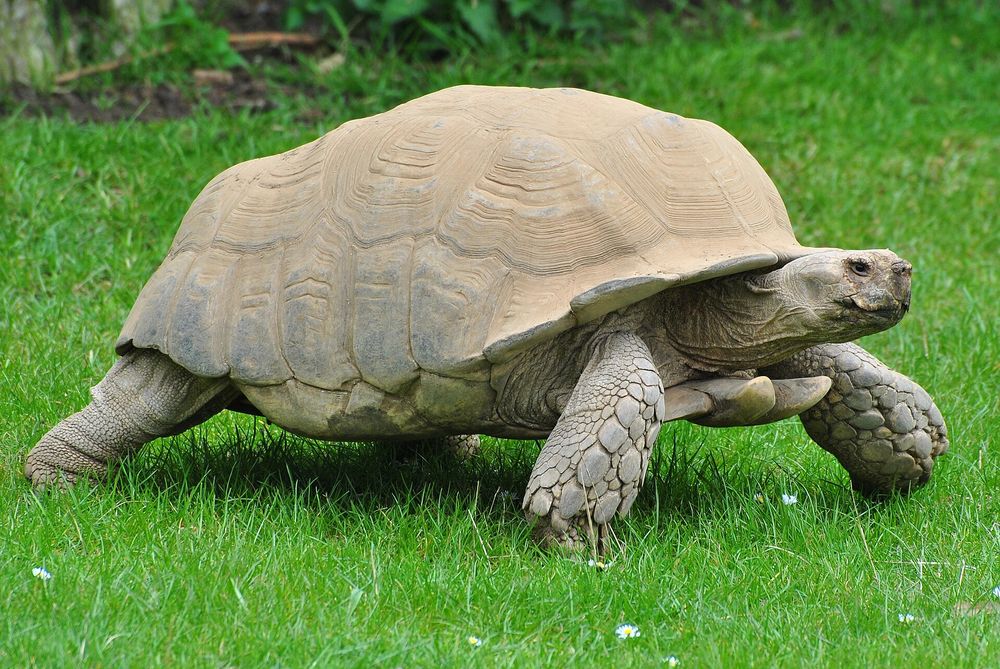

# Markdown Sample

## Table of Contents

<!--- An unordered list. Each list in the item has a [link_text](#anchor) -->

- [Headings](#headings)
- [Emphasis](#emphasis)
- [Lists](#lists)
- [Links and Images](#links-and-images)
- [Code Blocks](#code-blocks)
- [Blockquotes](#blockquotes)
- [Tables](#tables)
- [Definition Lists](#definition-lists)
- [Emoji](#emoji)

---

## Headings

# Heading 1

## Heading 2

### Heading 3

#### Heading 4

##### Heading 5

###### Heading 6

---

## Emphasis

<!--- 2 spaces <CR> at the end of each line -->
*Italic text* using asterisks or _underscores_  
**Bold text** using double asterisks or __double underscores__  
***Bold and Italic text*** using triple asterisks or ___triple underscores___  
~~Strikethrough text~~ using tildes  
Some text.  
A new line.

A new paragraph.

--- 

## Lists

### Unordered Lists

### Words with Multiple Meanings

<!-- 4 spaces for sub lists -->

- **Bank**
    - *Financial institution*: A place where money is deposited, withdrawn or loaned.
    - *River Bank*: The land alongside or sloping down to a river or lake.

- **Bat**
    - *Animal*: A nocturnal, flying animal.
    - *Sports equipment*: A tool used for hitting a ball in games like baseball.

- **Bark**
    - *Sound*: The sharp cry of a dog.
    - *Tree Covering*: The tough, protective outer layer of a tree trunk.

### Ordered List

<!-- 4 spaces for sub lists -->

1. **Duck**
    1. *Animal*: A water fowl with a broad bill.
    2. *Verb*: To lower the head or body quickly to avoid something.

2. **Spring**
    1. *Season*: The season following winter and preceding summer.
    2. *Coil*: A mechanical device that stores energy (as in spiral spring).

### Task Lists

- [x] Completed Task
- [ ] Incomplete Task

---

## Links and Images

### Links

My favourite search engine is [Google](https://www.google.com).

### Images

<!-- The ! indicate that this is an image.
    [Turtle] is the alternate text to display if the image cannot be found.
    (../../images/tortoise.jpg) is the URL or file path to the image.
-->


---

## Code Blocks

### Inline Code

Functional interfaces in Java can be annotated with `@FunctionalInterface` and if
the interface contains only one `abstract` method, the code will compile.

### Fenced Code Blocks

My first Java program:

```java
    public class Test {

  public static void main(String[] args) {
    System.out.println("Hello World!");
  }
}
```

## Blockquotes

> "Give me six hours to chop down a tree and I will
> spend the first four sharpening the axe."
>
> "You can fool all the people some of the time,
> and some of the people all the time,
> but you can't fool all the people all the time."
>
> > Abraham Lincoln (1809-1865).

## Tables

| Name   | Age | Nationality |
|--------|-----|-------------|
| John   | 12  | English     |
| Pierre | 25  | French      |
| Mark   | 45  | American    |    

## Definition Lists

<!--- 2 spaces after the 'k' and then Enter or <br /> -->

Bark
: The sharp cry of a dog.
: The tree trunk covering.  

Duck
: A water fowl.<br />
: To lower your head/body quickly to avoid something.  

## Emoji

😂 copied from emojipedia.org

